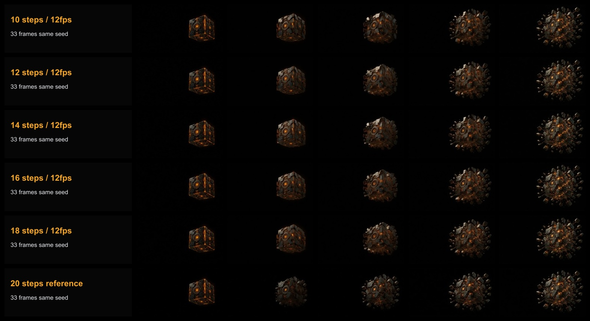
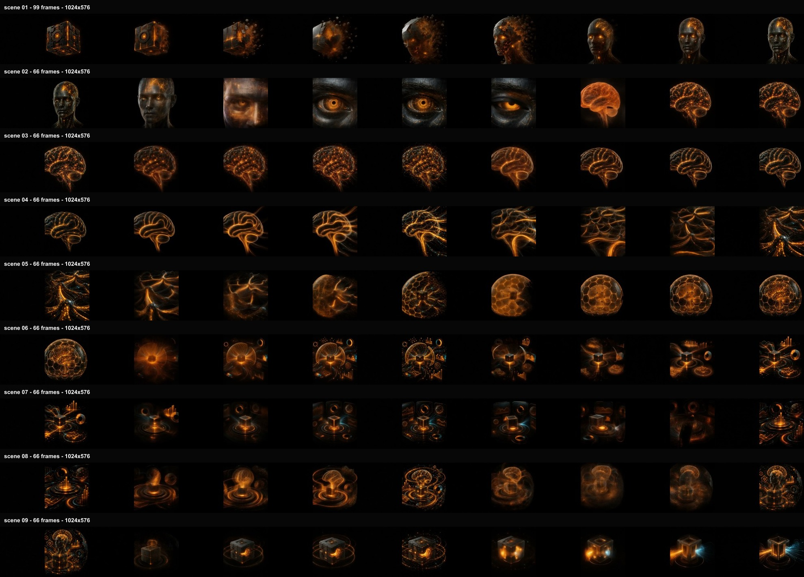
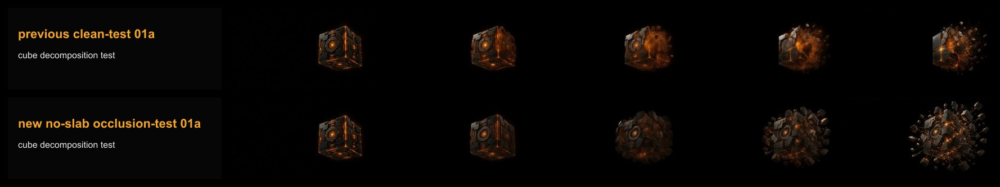
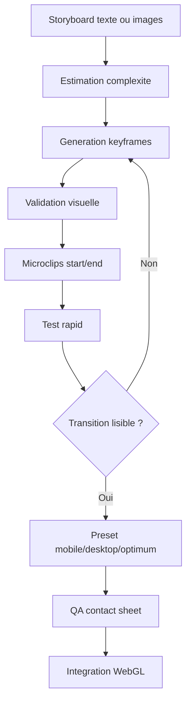

# AI Video WebGL Competences

> Kit pratique pour generer des videos IA avec **image de debut + image de fin**, tester les transitions Wan/LTX, puis integrer les meilleurs resultats dans une experience **WebGL / scroll video 16:9**.

Ce depot n'est pas une archive brute. C'est une synthese exploitable de nos tests: ce qui a marche, ce qui a echoue, les reglages utiles, les competences Codex/Cerveau et quelques exemples concrets.

---

## Resultat En Une Phrase

La meilleure strategie trouvee est: **storyboard en keyframes propres -> microclips image start/end -> Wan2.2/LTX local -> QA visuelle -> integration WebGL avec animation cadree a droite**.

Le prompt seul ne suffit pas pour une transformation complexe comme `cube -> visage -> oeil -> cerveau`. Il faut decouper.

---

## Ce Que Vous Pouvez Installer

| Element | Dossier | Utilite |
|---|---|---|
| Skill Codex `video-start-end` | `codex-skills/video-start-end` | Generer une video avec image de debut + image de fin |
| Skill Codex `webgl-right-video` | `codex-skills/webgl-right-video` | Creer des videos 16:9 pour site WebGL, sujet a droite |
| Competence Cerveau | `cerveau-competence/competence-video-start-end-webgl` | Competence partagee pour toutes les IA du cerveau central |
| Scripts install | `scripts/` | Installer skills, competence et modeles Wan2.2 |
| Exemples | `examples/` | Videos temoins, contact sheets, workflows ComfyUI |

---

## GitHub Et Contribution

| Fichier | Role |
|---|---|
| `CONTRIBUTING.md` | Regles de contribution, style et verification |
| `SECURITY.md` | Signaler un probleme de securite ou un secret expose |
| `CITATION.cff` | Metadata de citation pour GitHub |
| `docs/LICENSING.md` | Options de licence a choisir explicitement |
| `.github/ISSUE_TEMPLATE/` | Templates bug / feature |
| `.github/pull_request_template.md` | Checklist PR |
| `.github/workflows/validate-repo.yml` | Validation GitHub Actions des fichiers requis et JSON |

Note licence: aucune licence open source definitive n'est encore declaree. Voir `docs/LICENSING.md` avant reutilisation ou redistribution large.

---

## Apercu Visuel Des Tests

### Comparaison Des Steps



Conclusion: `10` et `12` steps restent trop mous. `14` steps devient exploitable. `16` steps est le meilleur compromis qualite/temps. `18/20` steps apportent peu en plus sur nos clips courts.

### Timeline Microclips



Conclusion: decouper une grande transformation en microclips donne beaucoup plus de controle que demander toute la sequence en une seule generation.

### Probleme Du Masque Noir



Conclusion: ne pas integrer un grand rectangle noir dur dans la video. Le modele peut le traiter comme une surface devant l'animation. Pour le site, il vaut mieux une video 16:9 sombre continue, avec le sujet a droite, et laisser le WebGL/CSS gerer le fond gauche.

---

## Videos Temoins Incluses

| Exemple | Ce Que Ca Montre |
|---|---|
| `examples/videos/scene-01a-start-only.mp4` | Test avec image de depart seule: plus libre, mais derive vite |
| `examples/videos/scene-01b-start-end.mp4` | Test avec image debut + image fin: meilleur controle du but |
| `examples/videos/c2r-v9-step-sweep-01a-steps10-fps12.mp4` | Reglage rapide, utile pour tester le mouvement, qualite faible |
| `examples/videos/c2r-v9-step-sweep-01a-steps14-fps12.mp4` | Premier seuil vraiment exploitable |
| `examples/videos/c2r-v9-step-sweep-01a-steps16-fps12.mp4` | Meilleur compromis observe |
| `examples/videos/c2r-v9-quality33-test-01a.mp4` | Test court qualitatif 33 frames |
| `examples/videos/c2r-v9-clean-composition-test-01a.mp4` | Test de composition plus propre |
| `examples/videos/c2r-v9-micro-pilot-01.mp4` | Exemple de sequence pilote en microclips |

---

## Reglages Retenus

| # | Preset | Objectif | Reglage | Duree video | Temps estime |
|---|---|---|---|---|---|
| 1 | `rapid` | Tester transitions | 33 frames / 12 fps / 10 steps | 2.75 s | 5-6 min par microclip |
| 2 | `mobile` | Qualite mobile | 33 frames / 12 fps / 14 steps | 2.75 s | 6-7 min |
| 3 | `desktop` | Qualite desktop | 49 frames / 24 fps / 16 steps | 2.04 s | 10-13 min |
| 4 | `optimum` | Court, net, valide | 33 frames / 24 fps / 14 steps | 1.375 s | 6-7 min |

Le preset `optimum` est volontairement court: il sert a obtenir une transformation nette au scroll, pas une longue video narrative.

---

## Resultats Des Tests

| Test | Resultat | Decision |
|---|---|---|
| Prompt seul | Trop aleatoire sur les transformations complexes | Abandon pour les sequences importantes |
| Image de depart seule | Bon pour exploration, mais derive de style et forme | Utile seulement en brouillon |
| Image debut + image fin | Meilleur controle de la destination | Methode retenue |
| Alpha transparent | Trop instable, resultats proches d'images alpha animees | Abandon pour la version principale |
| Video 16:9 avec noir a gauche | Risque d'occlusion/masque noir devant l'animation | A eviter |
| Video 16:9 sombre continue, sujet a droite | Plus naturel pour WebGL et scroll | Methode retenue |
| 10 steps | Rapide mais flou | Preset test uniquement |
| 14 steps | Premier seuil net/exploitable | Preset mobile/optimum |
| 16 steps | Meilleur compromis qualite/temps | Preset desktop |
| Microclips | Plus de controle et meilleurs raccords | Methode retenue |

---

## Conclusion Principale

Pour obtenir un rendu professionnel, il manque rarement un seul "meilleur prompt". Ce qui manque le plus souvent, c'est une **structure de production**:

1. Ecrire le storyboard.
2. Estimer la complexite.
3. Generer les keyframes.
4. Decouper en microclips.
5. Generer start/end.
6. Comparer les steps.
7. Garder seulement les meilleurs clips.
8. Integrer dans WebGL avec transitions deterministes.

C'est exactement ce que les deux skills et la competence automatisent.

---

## Installation Rapide

```powershell
git clone <URL_DU_REPO>
cd AI_VIDEO_WEBGL_COMPETENCES

powershell -ExecutionPolicy Bypass -File scripts/install-codex-skills.ps1
powershell -ExecutionPolicy Bypass -File scripts/install-cerveau-competence.ps1 -CerveauRoot D:\00_Cerveau_IA
```

Installer les modeles Wan2.2 dans ComfyUI:

```powershell
powershell -ExecutionPolicy Bypass -File scripts/install-wan22-models.ps1 -ComfyUIRoot "D:\ComfyUI\ComfyUI" -Profile ti2v5b
```

Pour le profil plus qualitatif:

```powershell
powershell -ExecutionPolicy Bypass -File scripts/install-wan22-models.ps1 -ComfyUIRoot "D:\ComfyUI\ComfyUI" -Profile i2v14b
```

---

## Modeles Recommandes

| Profil | Modeles | Usage |
|---|---|---|
| `ti2v5b` | `wan2.2_ti2v_5B_fp16`, `wan2.2_vae`, `umt5_xxl_fp8` | Demarrage, tests rapides, machine plus modeste |
| `i2v14b` | `wan2.2_i2v_high_noise_14B_fp8_scaled`, `wan2.2_i2v_low_noise_14B_fp8_scaled`, `wan_2.1_vae`, `umt5_xxl_fp8` | Meilleur controle image-to-video, plus lourd |

Sources utiles:

- ComfyUI Wan2.2 docs: https://docs.comfy.org/tutorials/video/wan/wan2_2
- ComfyUI Wan2.2 examples: https://comfyanonymous.github.io/ComfyUI_examples/wan22/
- Wan2.2 officiel: https://github.com/Wan-Video/Wan2.2

---

## Comment Appeler Les Competences

### Dans Codex

```text
Utilise video-start-end pour creer une video avec cette image de debut et cette image de fin. Propose les 4 presets et estime le temps.
```

```text
Utilise webgl-right-video pour creer une video 16:9 avec animation dans les deux tiers droits, fond sombre continu, sans masque noir dur.
```

### Dans Le Cerveau Central

```powershell
cd D:\00_Cerveau_IA\Conpetances
npm run competence:video:estimate -- --sections 10 --complexity complex --preset desktop
```

Exemple de sortie attendue:

```text
Sections: 10
Complexity: complex
Preset: Qualite desktop
Keyframes: 50
Micro-clips: 40
Settings: 49f/24fps/16steps
Gen time: environ 6h40 - 8h40
```

---

## Workflow Recommande Pour Un Nouveau Storyboard



---

## Regles De Prompt Qui Ont Fonctionne

### Eviter

```text
particles, dust, smoke, haze, fog, liquid morph, soft dissolve, energy cloud, abstract transformation
```

### Preferer

```text
hard-edged graphite plates, rigid black metal fragments, precise amber seams, mechanical assembly, solid geometric chunks, crisp engraved panels, clean cinematic lighting
```

---

## Pourquoi Ce Kit Est Utile

Il evite de refaire les memes erreurs:

- croire qu'un prompt suffit;
- faire une video trop longue d'un coup;
- integrer une zone noire dure dans la video;
- confondre nombre de frames, FPS et duree de generation;
- monter les steps sans mesurer le gain reel;
- oublier la QA visuelle.

Le but est simple: **tester vite, valider proprement, generer seulement ce qui vaut la peine**.
