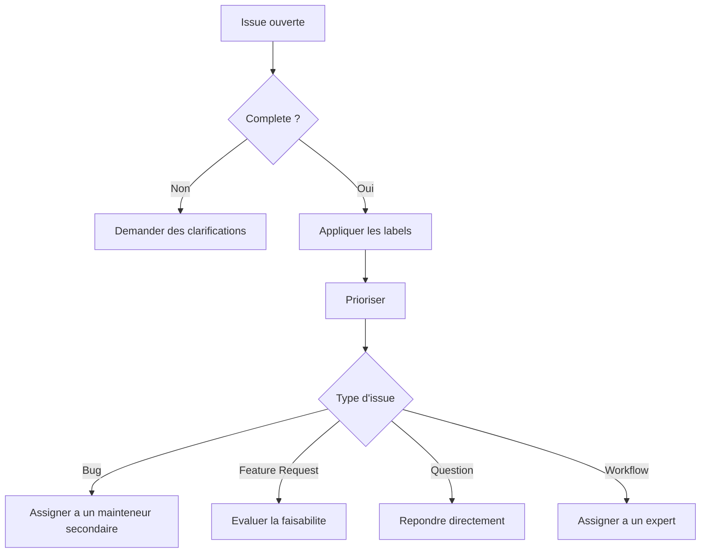

# Playbook du Mainteneur

Ce document decrit le workflow de maintenance pour le depot **AI_VIDEO_WEBGL_COMPETENCES**. Il couvre la gestion des issues, des pull requests, la validation des fichiers, les bonnes pratiques de publication, et l'utilisation de Mistral comme subagent.

---

## Table des matieres
1. [Roles et responsabilites](#roles-et-responsabilites)
2. [Workflow de triage des issues](#workflow-de-triage-des-issues)
3. [Processus de revue des PRs](#processus-de-revue-des-prs)
4. [Validation des fichiers JSON/YAML](#validation-des-fichiers-jsonyaml)
5. [Ajout de medias (captures, logs, etc.)](#ajout-de-medias-captures-logs-etc)
6. [Utilisation de Mistral comme subagent](#utilisation-de-mistral-comme-subagent)
7. [Mise a jour de la documentation](#mise-a-jour-de-la-documentation)
8. [Checklist avant commit/push](#checklist-avant-commitpush)
9. [Publication des notes de version](#publication-des-notes-de-version)
10. [Gestion des dependances et outils](#gestion-des-dependances-et-outils)
11. [Bonnes pratiques de communication](#bonnes-pratiques-de-communication)
12. [Annexes](#annexes)

---

## Roles et responsabilites

| Role | Responsabilites | Outils associes |
|------|-----------------|-----------------|
| **Mainteneur principal** | Validation finale des PRs, gestion des releases, coordination des mainteneurs secondaires. | GitHub, Mistral, scripts de validation. |
| **Mainteneur secondaire** | Revue des PRs, triage des issues, validation des fichiers. | GitHub, outils de validation locaux. |
| **Contributeur** | Ouverture d'issues, soumission de PRs, tests des workflows. | GitHub, ComfyUI, outils locaux. |
| **Mistral (subagent)** | Assistance pour la validation des fichiers, generation de code, verification de coherence. | Ce playbook, outils integres. |

> **Note** : Les mainteneurs doivent avoir une connaissance approfondie des workflows ComfyUI, des outils Wan/LTX, et des bonnes pratiques de developpement WebGL.

---

## Workflow de triage des issues

### 1. Reception des issues
- Les issues sont creees via les templates suivants :
  - `bug_report.yml` pour les bugs reproductibles.
  - `feature_request.yml` pour les demandes d'amelioration.
  - `question.yml` pour les questions ou demandes d'aide.
  - `workflow_request.yml` pour les demandes d'aide sur la configuration de workflows.

### 2. Classification initiale
Pour chaque issue, appliquer les etapes suivantes :

1. **Verifier la completude** :
   - L'issue contient-elle toutes les informations requises (ex: logs, captures, environnement) ?
   - Si non, demander des clarifications via un commentaire.

2. **Appliquer les labels** :
   - `bug` : Pour les bugs reproductibles.
   - `enhancement` : Pour les demandes de fonctionnalites.
   - `question` : Pour les questions ou demandes d'aide.
   - `workflow` : Pour les demandes liees a la configuration de workflows.
   - `help wanted` : Si la resolution necessite une expertise externe.
   - `needs-triage` : Si l'issue necessite une analyse supplementaire.

3. **Priorisation** :
   - **P0 (Critique)** : Bugs bloquants pour la majorite des utilisateurs.
   - **P1 (Eleve)** : Bugs non bloquants ou demandes de fonctionnalites critiques.
   - **P2 (Moyen)** : Ameliorations mineures ou bugs non critiques.
   - **P3 (Faible)** : Demandes de fonctionnalites mineures ou questions.

### 3. Analyse et assignation
- **Bugs** : Assigner a un mainteneur secondaire pour reproduction et validation.
- **Demandes de fonctionnalites** : Evaluer la faisabilite et l'alignement avec la roadmap du projet.
- **Questions** : Repondre directement ou rediriger vers les ressources appropriees (ex: FAQ, documentation).
- **Demandes de workflow** : Assigner a un mainteneur avec expertise en ComfyUI/Wan/LTX.

### 4. Fermeture des issues
- **Resolution** : Fermer l'issue avec un commentaire detaillant la solution ou la raison de la fermeture.
- **Duplication** : Si l'issue est un doublon, fermer avec un lien vers l'issue originale.
- **Non reproductible** : Fermer avec une explication si le bug ne peut pas etre reproduit.
- **Hors scope** : Fermer avec une justification si la demande ne correspond pas a la vision du projet.

---

## Processus de revue des PRs

### 1. Reception des PRs
- Les PRs doivent suivre le template `.github/pull_request_template.md`.
- Verifier que la PR est liee a une issue (si applicable) via le champ `Related Issue`.

### 2. Verifications preliminaires
1. **Titre et description** :
   - Le titre doit etre clair et descriptif (ex: `Fix: Correction du bug de rendu WebGL`).
   - La description doit expliquer les changements apportes et leur impact.

2. **Liens vers les issues** :
   - Si la PR resout une issue, ajouter `Fixes #<numero>` dans la description.

3. **Labels** :
   - Appliquer les labels appropries (`bug`, `enhancement`, `documentation`, etc.).

### 3. Revue technique
Pour chaque PR, effectuer les verifications suivantes :

#### a. Coherence du code
- **Style** : Respect des conventions de nommage (ex: `snake_case` pour les variables, `PascalCase` pour les classes).
- **Structure** : Le code est-il modulaire et bien commente ?
- **Tests** : Si applicable, des tests unitaires ou des exemples de validation sont-ils fournis ?

#### b. Validation des fichiers
- **JSON/YAML** : Utiliser les outils de validation locaux (voir [Validation des fichiers JSON/YAML](#validation-des-fichiers-jsonyaml)).
- **Workflows ComfyUI** : Verifier que les workflows JSON sont valides et fonctionnels.
- **Exemples** : Les fichiers d'exemple (ex: videos, captures) sont-ils coherents avec les changements ?

#### c. Securite
- **Secrets** : Aucun secret (cles API, mots de passe) ne doit etre commit.
- **Dependances** : Verifier que les dependances ajoutees sont necessaires et a jour.

#### d. Documentation
- Les changements sont-ils documentes dans les fichiers appropries (ex: README, docs/*) ?
- Si une nouvelle fonctionnalite est ajoutee, un exemple d'utilisation est-il fourni ?

### 4. Tests et validation
- **Validation locale** : Suivre les instructions de `docs/LOCAL_VALIDATION.md` pour tester les changements.
- **Validation CI** : Verifier que les workflows GitHub (ex: `.github/workflows/validate-repo.yml`) passent sans erreur.

### 5. Approbation et fusion
- **Approbation** : Au moins un mainteneur secondaire doit approuver la PR.
- **Fusion** : Le mainteneur principal peut fusionner la PR apres validation.
- **Commentaires** : Fournir un feedback constructif dans les commentaires de revue.

---

## Validation des fichiers JSON/YAML

### Outils de validation
Le projet utilise les outils suivants pour valider les fichiers JSON/YAML :

1. **Validation locale** :
   - Utiliser `jq` pour valider les fichiers JSON :
     ```bash
     jq empty fichier.json
     ```
   - Utiliser `yamllint` pour valider les fichiers YAML :
     ```bash
     yamllint fichier.yaml
     ```

2. **Validation CI** :
   - Le workflow `.github/workflows/validate-repo.yml` valide automatiquement les fichiers JSON/YAML a chaque push.

### Bonnes pratiques
- **JSON** :
  - Utiliser des outils comme `jq` ou `jsonlint` pour verifier la syntaxe.
  - Eviter les commentaires dans les fichiers JSON (non supportes par defaut).
  - Utiliser des outils comme `json-schema` pour valider la structure si un schema est disponible.

- **YAML** :
  - Respecter l'indentation (2 espaces par niveau).
  - Eviter les tabulations.
  - Utiliser des guillemets pour les chaines de caracteres contenant des caracteres speciaux.

### Exemple de validation
```bash
# Valider un fichier JSON
jq empty ./workflows/valid_workflow.json

# Valider un fichier YAML
pip install yamllint
yamllint ./docs/example.yaml
```

---

## Ajout de medias (captures, logs, etc.)

### Quand ajouter des medias ?
- **Bugs** : Ajouter des captures d'ecran ou des logs pour illustrer le probleme.
- **Demandes de fonctionnalites** : Ajouter des exemples de sorties attendues (ex: captures de workflows).
- **Questions** : Ajouter des captures de l'interface ou des logs pour aider a diagnostiquer le probleme.

### Bonnes pratiques
- **Format** : Utiliser des formats sans perte (PNG, SVG) pour les captures. Pour les videos, utiliser des formats compresses (MP4, WebM).
- **Taille** : Optimiser les fichiers pour reduire leur poids (ex: utiliser des outils comme `ffmpeg` pour compresser les videos).
- **Emplacement** : Stocker les medias dans le dossier `media/` ou dans un sous-dossier dedie (ex: `media/bug_reports/`).
- **Nommage** : Utiliser des noms descriptifs (ex: `bug_webgl_render_error.png` au lieu de `capture1.png`).

### Exemple de structure
```
media/
 bug_reports/
    bug_webgl_render_error.png
    bug_comfyui_workflow_error.png
 feature_requests/
    feature_new_transition_effect.mp4
 examples/
     workflow_example.json
```

---

## Utilisation de Mistral comme subagent

### Role de Mistral
Mistral est utilise comme subagent pour :
- **Validation des fichiers** : Verification de la syntaxe JSON/YAML, coherence des workflows ComfyUI.
- **Generation de code** : Creation de snippets de code ou de configurations pour les PRs.
- **Verification de coherence** : Assurer que les changements sont alignes avec la documentation et les bonnes pratiques.

### Workflow avec Mistral
1. **Demande d'assistance** :
   - Ouvrir une issue ou une PR et mentionner `@mistral` pour demander une validation ou une generation de code.
   - Fournir un contexte clair (ex: extrait de code, description du probleme).

2. **Validation par Mistral** :
   - Mistral verifie la syntaxe et la coherence des fichiers.
   - Si des erreurs sont detectees, Mistral fournit un feedback avec des suggestions de correction.

3. **Integration des suggestions** :
   - Appliquer les corrections suggerees par Mistral.
   - Valider les changements localement avant de commit.

### Exemple d'utilisation
```markdown
@mistral Verifie la syntaxe de ce fichier JSON :
```json
{
  "nodes": [
    {
      "id": "node_1",
      "type": "KSampler",
      "inputs": {
        "seed": 12345
      }
    }
  ]
}
```
```

---

## Mise a jour de la documentation

### Quand mettre a jour la documentation ?
- **Nouvelle fonctionnalite** : Documenter l'utilisation et les exemples.
- **Changement de workflow** : Mettre a jour les guides d'integration (ex: `docs/COMFYUI_SETUP_CHECKLIST.md`).
- **Correction de bug** : Documenter les solutions ou les contournements.
- **Nouveaux outils** : Ajouter des sections dediees dans les docs existantes.

### Processus de mise a jour
1. **Creer une branche** : `git checkout -b docs/update-<description>`
2. **Modifier les fichiers** : Mettre a jour les fichiers de documentation concernes.
3. **Valider les changements** : Verifier que la documentation est coherente avec le code.
4. **Ouvrir une PR** : Suivre le processus standard de revue des PRs.

### Bonnes pratiques
- **Clarte** : Utiliser un langage simple et des exemples concrets.
- **Structure** : Organiser la documentation avec des titres et des sous-titres clairs.
- **Liens** : Ajouter des liens vers les ressources externes si necessaire.
- **Mises a jour regulieres** : Verifier que la documentation est a jour apres chaque release.

---

## Checklist avant commit/push

Avant de commit ou de push, effectuer les verifications suivantes :

### 1. Verifications locales
- [ ] **Validation des fichiers** :
  - JSON : `jq empty fichier.json`
  - YAML : `yamllint fichier.yaml`
- [ ] **Tests** : Executer les tests locaux (si disponibles) ou valider les workflows manuellement.
- [ ] **Linting** : Verifier le style du code (ex: `black` pour Python, `prettier` pour JavaScript).
- [ ] **Securite** : Aucun secret n'est commit (utiliser `git-secrets` si necessaire).

### 2. Verifications Git
- [ ] **Messages de commit** : Les messages suivent la convention [Conventional Commits](https://www.conventionalcommits.org/) (ex: `feat: add new transition effect`).
- [ ] **Branche a jour** : La branche est synchronisee avec `main` (`git pull origin main`).
- [ ] **Fichiers inutiles** : Aucun fichier temporaire ou de build n'est commit.

### 3. Verifications GitHub
- [ ] **PR template** : La PR suit le template `.github/pull_request_template.md`.
- [ ] **Liens vers les issues** : La PR est liee a une issue (si applicable).
- [ ] **Labels** : Les labels appropries sont appliques.

### 4. Documentation
- [ ] **Mise a jour** : La documentation est a jour (ex: README, docs/*).
- [ ] **Exemples** : Les exemples fournis sont fonctionnels et documentes.

---

## Publication des notes de version

### Processus de release
1. **Preparation** :
   - Verifier que toutes les PRs fusionnees sont documentees.
   - Mettre a jour le fichier `CHANGELOG.md` (si disponible) ou creer une section dans `docs/RELEASE_NOTES.md`.

2. **Validation** :
   - Verifier que les workflows CI passent.
   - Tester les exemples fournis dans la release.

3. **Creation de la release** :
   - Creer une nouvelle release sur GitHub avec un tag version (ex: `v1.2.0`).
   - Inclure un resume des changements et les liens vers les PRs fusionnees.

4. **Communication** :
   - Annoncer la release sur les canaux appropries (ex: Discord, forum).
   - Mettre a jour le README et les docs pour refleter la nouvelle version.

### Exemple de notes de version
```markdown
## v1.2.0 - 2026-06-03

### Ajouts
- Ajout du support pour les transitions personnalisees dans les workflows ComfyUI.
- Nouvelle competence `VideoStitcher` pour combiner plusieurs flux video.

### Corrections
- Correction d'un bug de rendu WebGL dans les exemples de base.
- Fix pour les workflows Wan/LTX avec des modeles haute resolution.

### Ameliorations
- Optimisation des performances pour les workflows ComfyUI.
- Documentation mise a jour pour les nouvelles fonctionnalites.
```

---

## Gestion des dependances et outils

### Dependances principales
- **ComfyUI** : Outil principal pour les workflows de generation video.
- **Wan/LTX** : Outils pour la generation de videos et d'images.
- **WebGL** : Pour l'integration et le rendu dans le navigateur.
- **Python** : Version 3.10 ou superieure.
- **Node.js** : Pour les outils de build et les scripts.

### Outils de developpement
- **Git** : Gestion des versions.
- **GitHub CLI** : Pour interagir avec GitHub en ligne de commande.
- **Docker** : Pour les environnements de test isoles (si utilise).
- **VS Code** : Editeur recommande avec les extensions pour JSON, YAML, et Python.

### Configuration locale
Pour configurer un environnement de developpement local :
1. Cloner le depot :
   ```bash
   git clone https://github.com/RYJITS/AI_VIDEO_WEBGL_COMPETENCES.git
   cd AI_VIDEO_WEBGL_COMPETENCES
   ```
2. Installer les dependances :
   ```bash
   pip install -r requirements.txt  # Si un fichier requirements.txt existe
   ```
3. Configurer les outils locaux :
   - Installer `jq`, `yamllint`, et d'autres outils de validation.
   - Configurer les variables d'environnement necessaires.

---

## Bonnes pratiques de communication

### Avec les contributeurs
- **Reactivite** : Repondre aux issues et PRs dans un delai raisonnable (ex: sous 48h).
- **Clarte** : Fournir des feedbacks constructifs et des explications detaillees.
- **Empathie** : Reconnaitre les efforts des contributeurs et les encourager.

### En interne (equipe de maintenance)
- **Reunions** : Organiser des reunions regulieres pour discuter des priorites et des blocages.
- **Documentation** : Tenir a jour un tableau de bord des issues et PRs en cours.
- **Transparence** : Partager les decisions importantes avec l'equipe.

### Gestion des conflits
- **Resolution** : Aborder les desaccords de maniere constructive et basee sur des faits.
- **Mediation** : Impliquer un tiers neutre si necessaire.

---

## Annexes

### A. Exemple de workflow de triage


### B. Exemple de checklist de revue de PR
- [ ] Titre et description clairs.
- [ ] Liens vers les issues (si applicable).
- [ ] Labels appropries.
- [ ] Code coherent et bien commente.
- [ ] Validation des fichiers JSON/YAML.
- [ ] Tests locaux passes.
- [ ] Documentation mise a jour.
- [ ] Pas de secrets commit.

### C. Ressources utiles
- [Documentation officielle ComfyUI](https://docs.comfy.org/)
- [Wan/LTX Documentation](https://wan-22.github.io/)
- [WebGL Specification](https://www.khronos.org/registry/webgl/specs/latest/)
- [GitHub Flow](https://docs.github.com/en/get-started/quickstart/github-flow)

---

## Licence

Ce playbook est distribue sous la licence **MIT**. Voir le fichier `LICENSE` pour plus de details.

---

*Derniere mise a jour : 2026-06-03*
*Mainteneur principal : A definir*
